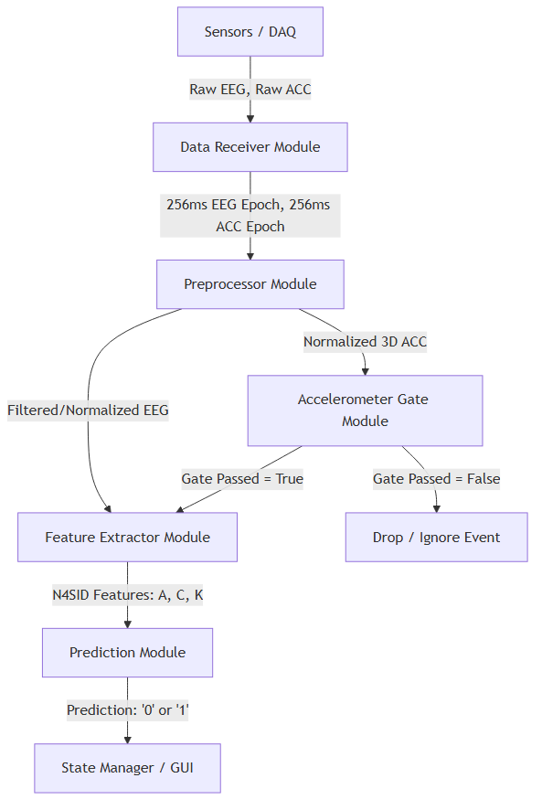

# Real-Time EEG-based Fall Prediction System

## Overview
This project implements a rigorous machine learning pipeline to evaluate and run an EEG-based fall detection system. It detects unexpected falls in real-time by combining **state-space features extracted from brainwave signals (EEG)** with **physical movement data (Accelerometer)**. 

To ensure high accuracy and minimal false alarms in a real-world wearable context, the system uses a dual-stage "gated" architecture: it first checks for physical perturbation using the accelerometer before committing computational resources to analyze the EEG for cognitive panic patterns.

## Core Architecture & Strategy
- **Dual-Modality Sensing**: Combines a 3-axis Accelerometer (ACC) and a single-channel EEG (Channel R6).
- **Accelerometer Gate**: Acts as a low-power first pass. If the physical acceleration does not exceed a dynamically calculated threshold, the system ignores the event.
- **EEG N4SID Feature Extraction**: For events passing the ACC gate, the system applies **N4SID** to the EEG signal to extract dynamic state-space matrices (`A`, `C`, `K`). This captures the underlying brain state (panic vs. expected movement).
- **Machine Learning Classification**: A Random Forest ensemble (`fitcensemble` with 30 bagged trees) classifies whether a fall has occurred.
- **Multithreading**: The architecture heavily utilizes MATLAB's Parallel Computing Toolbox. Model training is heavily parallelized across subjects (`parfor`), and real-time live predictions are offloaded to background workers (`parfeval`) to ensure UI and DAQ responsiveness.

## System Architecture

## Main Entry Points

The project has been decoupled into distinct executable scripts based on your use case:

### 1. `run_live_system.m` (Real-Time Live Monitor)
Orchestrates a live connection to a Python Brainflow DAQ (via TCP) and processes continuous real-time data.
- Features a **Real-Time GUI** displaying scrolling plots for the 256ms EEG Window and the ACC Magnitude against the dynamic gate threshold.
- Uses **Asynchronous Multithreading** to push heavy N4SID calculations to a background thread, preventing UI freezing or packet loss.
- Displays a dynamic Color-Coded Status Lamp (Monitoring vs. Fall Detected).

### 2. `train_model.m` (Global Model Generator)
Generates the core machine learning model required by the live system.
- Processes the entire historical dataset using parallel workers (`parfor`).
- Calculates the global EEG normalization cap and the accelerometer gating threshold.
- Saves the trained RF model and parameters into `trained_model.mat`.

### 3. `run_offline_metrics_gui.m` (Offline Metrics Explorer)
A user-friendly GUI specifically for evaluating the trained model against historical `.edf` data without writing code.
- Features a dropdown to select individual subjects or "All Subjects".
- Displays a progress bar during evaluation.
- Outputs detailed metrics directly to a built-in text console: Sensitivity, Specificity, Balanced Accuracy, and precise False Positive breakdowns (Class 0 expected misclassification vs. Class 2 silence misclassification).

### 4. `master_pipeline.m` (Legacy LOSO Validator)
The original monolithic script used to rigorously validate the algorithm architecture using a strict Leave-One-Subject-Out (LOSO) cross-validation method. It ensures the model can generalize to completely unseen users without data leakage.

## Decoupled Processing Modules

The signal processing logic has been broken down into strict Input/Output modules to support decoupled testing and live execution:
- **`preprocess_signal.m`**: Filters EEG and calculates normalized 3D ACC magnitude.
- **`evaluate_acc_gate.m`**: Checks physical movement against the gating threshold.
- **`extract_features.m`**: Wraps MATLAB's `n4sid` to extract multi-dimensional state-space feature vectors.
- **`predict_fall.m` / `predict_fall_wrapper.m`**: Standard and background-worker wrappers for executing the Random Forest prediction.
- **`normalized_acc.m`**: Applies Savitzky-Golay filtering to smooth raw accelerometer channels.

## Usage

1. **Setup Workspace**: Ensure your MATLAB workspace is set to the project root directory containing the `Raw_Data/` folder (with `All34_table.mat`, `Label_Table.mat`, and `Filtered/*.edf`).
2. **Train the Model**: Execute `train_model.m` to generate `trained_model.mat`.
3. **Explore Metrics**: Run `run_offline_metrics_gui.m` to explore how the model performs on the historical dataset via the interactive UI.
4. **Go Live**: Start the Python Brainflow DAQ (broadcasting to `127.0.0.1:5005`), then execute `run_live_system.m` to monitor live streams and predictions.
